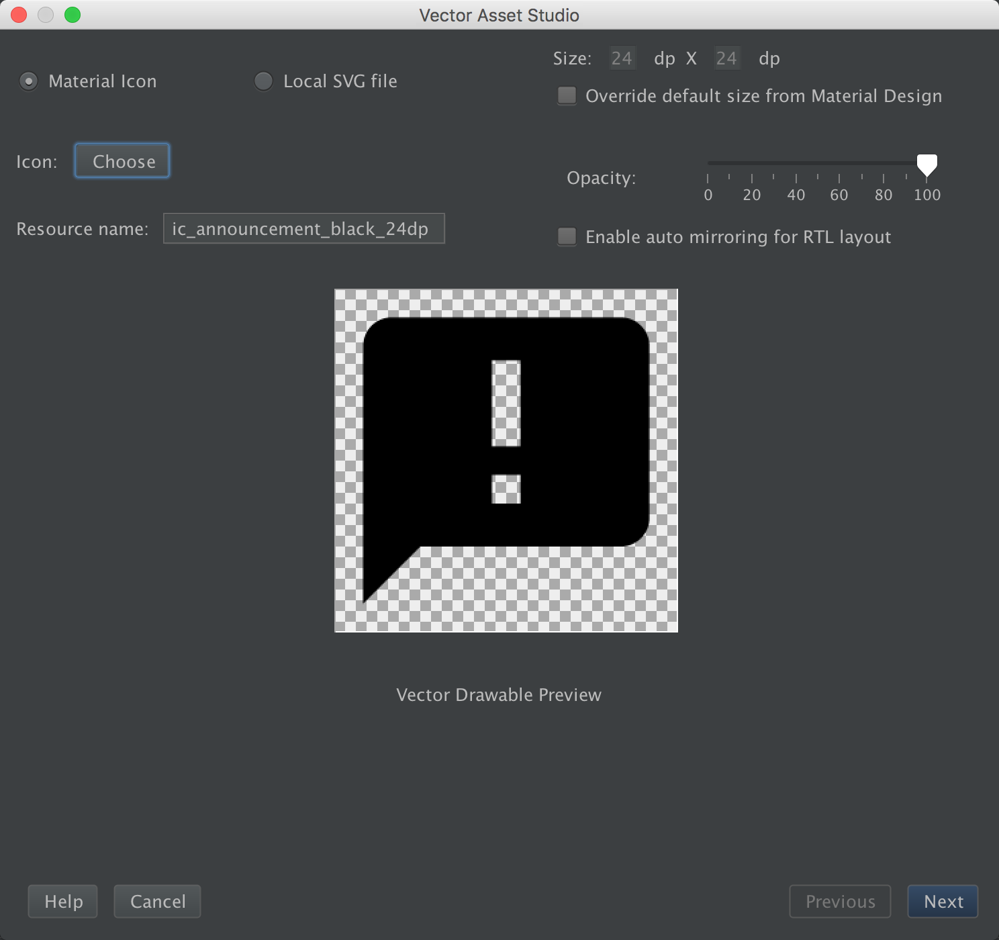
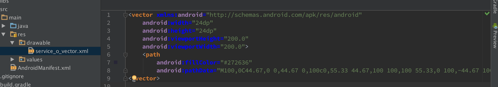

## 矢量图SVG\ICONFONT显示功能

### 注意事项
1. ImageView的必须用app:srcCompat在xml中配置iconfont的图片，否则在低于5.0版本的手机上会报错
2. 目前来看，CheckBox可以直接使用由vector图片组成的selector，前提是CheckBox所在的Activity是继承自AppCompatActivity，否则在低于5.0版本的手机上会crash
3. 此处是在 support 包 23.4.0 上的新特性, 默认移除了非imageview自动使用vector, 开启此方法,可以自由使用
```java
   static {
    	AppCompatDelegate.setCompatVectorFromResourcesEnabled(true);
   }
```

### 如何使用（初级）
Android在appcompat的23.2.0版本以后支持了vector 适量图片的显示，最小api支持到API-7，下面是使用步骤

1. 引用 appcompat-v7:23.2.0
```java
   dependencies {
   	compile 'com.android.support:appcompat-v7:23.2.0'
   }
```
2. 关闭vector 输出 png 的功能（不添加此行会导致在android5.0以下是以png输出显示的）
```groovy
   android{
       defaultConfig{
           vectorDrawables.useSupportLibrary = true
       }
   }
```
3. 右键单击res/drawable —> new —> Vector Asset 出现下列弹框
   
4. 点击 Next 生成xml文件，点击Preview可以预览
   
5. 在ImageView ImageButton等需要用到的地方加入下面代码
```xml
	xmlns:app="http://schemas.android.com/apk/res-auto"
	...
	<ImageView
		android:layout_width="100dp"
		android:layout_height="100dp"
		app:srcCompat="@drawable/service_o_vector"/>
```
   或者使用
```java
	imageView.setImageResource(R.drawable.service_o_vector);
```
6. 然后就可以预览和打包输出了

### 如何使用（高级）

1.   在使用iconfont最大的场景就是多个业务使用同一个图片，但是颜色不一样可以通过下面的方法。
```xml
	<ImageView
		android:layout_width="100dp"
		android:layout_height="100dp"
		app:srcCompat="@drawable/service_o_vector
		android:tint="@color/white"/>
```
> `android:tint`
> 1. 这个属性只得是更改颜色，可以达到动态更改图片的目的
> 2. 这个属性除了传入单一颜色意外，可以传入颜色的selector以达到imageView的点击或者聚焦的效果

2.   代码中动态获取Vector及更改颜色，下面方法获取的drawable，使用`imageView.setImageResource(drawable)`进行设置
```java
     /**
     * 获取带有点击颜色效果的VectorDrawable
     * @param resources
     * @param res
     * @param colorStateList
     * @return
     */
    public Drawable getVectorResource(Resources resources, int res, ColorStateList colorStateList){
        VectorDrawableCompat drawable = VectorDrawableCompat.create(resources, res, resources.newTheme());
        if(colorStateList != null && drawable != null){
            drawable.setTintList(colorStateList);
        }
        return drawable;
    }
    
    /**
     * 获取单色的VectorDrawable
     * @param resources
     * @param res
     * @param color
     * @return
     */
    public Drawable getVectorResource(Resources resources, int res, int color){
        VectorDrawableCompat drawable = VectorDrawableCompat.create(resources, res, resources.newTheme());
        if(drawable != null){
            drawable.setTint(color);
        }
        return drawable;
    }
```

